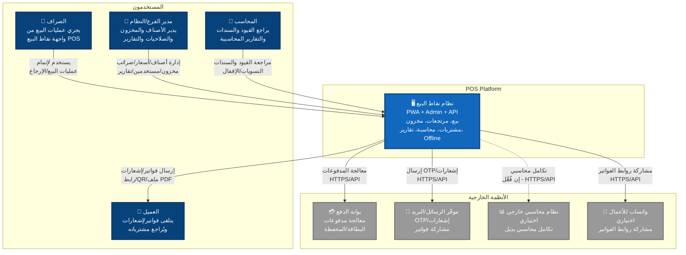
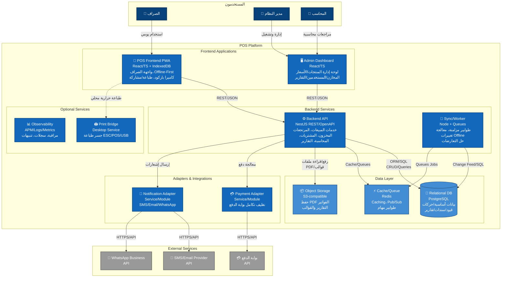
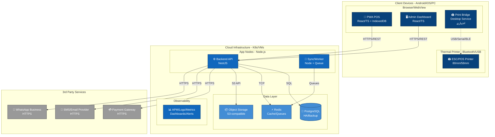
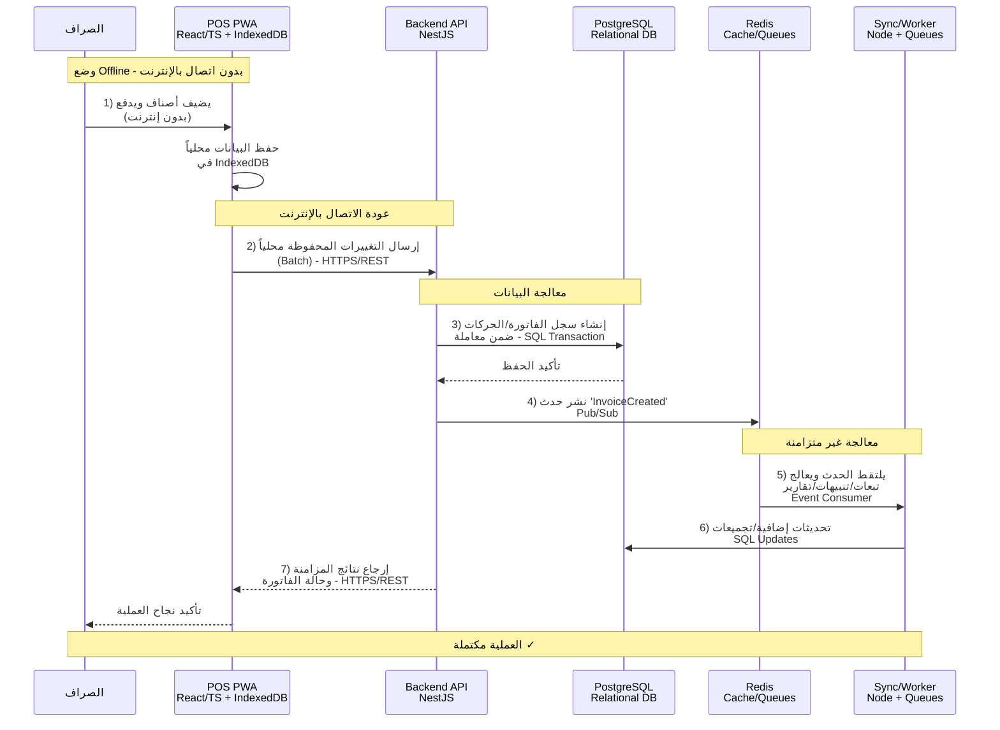

# C4 Model — نظام نقاط بيع شامل (POS Platform)

> هذا المستند بصيغة **Markdown** ويحتوي على مخططات **Mermaid** وفق مستويات C4 (Context, Container, Component, Deployment + Dynamic).  
> المكوّنات مستخلصة من نطاق العمل: POS للصراف، مرتجعات، مخزون، مشتريات، محاسبة أساسية، تقارير، أمان متقدم، Offline‑First، تكاملات دفع/رسائل، طباعة حرارية.

---

## محتويات المستند

1. [Level 1 — System Context](#level-1--system-context-نطاق-النظام-وعلاقاته)
2. [Level 2 — Container Diagram](#level-2--container-diagram-حاويات-النظام)
3. [Level 3 — Component Diagram](#level-3--component-diagram-داخل-backend-api)
4. [Level 4 — Deployment Diagram](#level-4--deployment-diagram-النشر-والتشغيل)
5. [Dynamic — سيناريو: بيع Offline ثم مزامنة](#dynamic--سيناريو-بيع-offline-ثم-مزامنة)

---

## Level 1 — System Context (نطاق النظام وعلاقاته)

يوضح هذا المستوى العلاقات بين النظام والأنظمة الخارجية والمستخدمين.

---

## Level 2 — Container Diagram (حاويات النظام)

يوضح هذا المستوى الحاويات (التطبيقات والخدمات) التي تشكل النظام والعلاقات بينها.

---

## Level 3 — Component Diagram (داخل Backend API)

يوضح هذا المستوى المكوّنات الداخلية لـ Backend API والعلاقات بينها.

```mermaid
graph TB
    subgraph backendapi["Backend API - NestJS"]
        subgraph infrastructure["Infrastructure Layer"]
            gateway["🌐 API Gateway<br/>HTTP Controllers<br/>REST/OpenAPI endpoints، routing"]
            auth["🔐 Authentication & RBAC<br/>Guards/Policies<br/>JWT/2FA/WebAuthn<br/>أدوار وصلاحيات"]
            common["📚 Common Library<br/>Shared Lib<br/>DTOs/Validators/Mappers/Utilities"]
            audit["📝 Audit & Logging<br/>Service<br/>سجلات دقيقة<br/>من/متى/ماذا/قبل-بعد"]
        end
        
        subgraph business["Core Business Modules"]
            sales["💰 Sales Module<br/>Business Logic<br/>إنشاء/تعديل/طباعة<br/>مشاركة فواتير"]
            returns["↩️ Returns Module<br/>Business Logic<br/>إرجاع كلي/جزئي<br/>عكس حركة مخزون"]
            inventory["📦 Inventory Module<br/>Business Logic<br/>أصناف، مخازن، حركات<br/>تحويلات، جرد"]
            purchase["🛒 Purchasing Module<br/>Business Logic<br/>موردون، فواتير مشتريات<br/>شروط دفع"]
            accounting["📊 Accounting Module<br/>Business Logic<br/>دليل حسابات، قيود<br/>سندات، إقفال"]
            reporting["📈 Reporting Module<br/>Business Logic<br/>تقارير ولوحة مؤشرات<br/>PDF/Excel"]
        end
        
        subgraph integration["Integration & Sync"]
            syncmgr["🔄 Sync Manager<br/>Background Service<br/>مزامنة Offline، حل تعارضات<br/>ChangeSet"]
            payadapter["💳 Payment Adapter<br/>Integration Service<br/>تكامل بوابة الدفع"]
            notifadapter["📧 Notification Adapter<br/>Integration Service<br/>SMS/Email/WhatsApp"]
        end
    end
    
    subgraph external["External Data & Services"]
        db[("💾 PostgreSQL<br/>Relational Database")]
        cache["⚡ Redis<br/>Cache & Message Queue"]
        store["📦 Object Storage<br/>S3-compatible Files"]
    end
    
    gateway -->|التحقق والتفويض| auth
    gateway -->|POST/GET/PUT<br/>/api/sales| sales
    gateway -->|POST/GET<br/>/api/returns| returns
    gateway -->|POST/GET/PUT<br/>/api/inventory| inventory
    gateway -->|POST/GET<br/>/api/purchases| purchase
    gateway -->|POST/GET<br/>/api/accounting| accounting
    gateway -->|GET<br/>/api/reports| reporting
    
    sales -->|توليد قيود الإيرادات<br/>الصندوق/الضريبة| accounting
    returns -->|عكس الإيرادات<br/>المخزون/الضريبة| accounting
    inventory -->|تسويات/تكاليف<br/>المخزون| accounting
    purchase -->|قيود المشتريات<br/>والموردين| accounting
    
    sales -->|CRUD/Queries SQL| db
    returns -->|CRUD/Queries SQL| db
    inventory -->|CRUD/Queries SQL| db
    purchase -->|CRUD/Queries SQL| db
    accounting -->|CRUD/Queries SQL| db
    reporting -->|Queries/Aggregations SQL| db
    audit -->|Append-only logs SQL| db
    
    syncmgr -->|Queues/Events<br/>Pub/Sub| cache
    payadapter -->|Idempotency Keys/Events<br/>Redis| cache
    notifadapter -->|Async Queue<br/>Redis| cache
    
    payadapter -->|Transaction Records<br/>SQL| db
    
    reporting -->|توليد/قراءة<br/>PDF/Excel - S3 API| store
    
    classDef infraStyle fill:#438dd5,stroke:#2e6295,color:#fff,stroke-width:2px
    classDef businessStyle fill:#1168bd,stroke:#0b4884,color:#fff,stroke-width:2px
    classDef integrationStyle fill:#6b8e23,stroke:#556b2f,color:#fff,stroke-width:2px
    classDef dataStyle fill:#999999,stroke:#6b6b6b,color:#fff,stroke-width:2px
    
    class gateway,auth,common,audit infraStyle
    class sales,returns,inventory,purchase,accounting,reporting businessStyle
    class syncmgr,payadapter,notifadapter integrationStyle
    class db,cache,store dataStyle
```

---

## Level 4 — Deployment Diagram (النشر والتشغيل)

يوضح هذا المستوى كيفية نشر النظام والبنية التحتية المطلوبة لتشغيله.

---

## Dynamic — سيناريو: بيع Offline ثم مزامنة

يوضح هذا السيناريو التدفق التفصيلي لعملية البيع في وضع Offline ثم مزامنة البيانات مع الخادم عند عودة الاتصال.

---

## ملاحظات تقنية

### المزايا الرئيسية للنظام:

1. **Offline-First Architecture**: يعمل النظام بكفاءة دون اتصال بالإنترنت مع مزامنة تلقائية
2. **قابلية التوسع**: بنية موزعة تدعم النمو الأفقي
3. **الأمان المتقدم**: مصادقة متعددة العوامل وصلاحيات دقيقة
4. **التكامل السلس**: دعم متعدد لبوابات الدفع والإشعارات
5. **المراقبة والمتابعة**: نظام شامل للسجلات والتنبيهات

### التقنيات المستخدمة:

- **Frontend**: React, TypeScript, IndexedDB, PWA
- **Backend**: NestJS, Node.js, REST API, OpenAPI
- **Database**: PostgreSQL (Relational DB)
- **Cache & Queue**: Redis
- **Storage**: S3-compatible Object Storage
- **Deployment**: Kubernetes/VMs, Docker
- **Monitoring**: APM, Logs, Metrics, Dashboards
